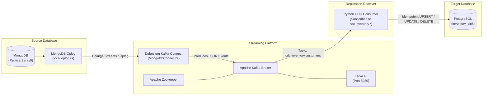

# Event-Driven CDC via Debezium & Apache Kafka: MongoDB to PostgreSQL Replication

A production-grade Proof of Concept (POC) demonstrating **Change Data Capture (CDC)** using **Debezium** to capture transaction log (oplog) events from **MongoDB**, publish them as event streams to **Apache Kafka**, and replicate/upsert them in real-time into **PostgreSQL**.

---

## 🏛️ Architecture Overview



---

## 📦 Components Included

| Service | Container Name | Port | Description |
| :--- | :--- | :--- | :--- |
| **MongoDB** | `mongodb` | `27017` | Source database running with replica set `rs0` for Oplog change streams. |
| **Mongo Initializer** | `mongo-init` | - | Automated startup job that executes `rs.initiate()` and ensures collections exist. |
| **Zookeeper** | `zookeeper` | `2181` | Coordination service for Apache Kafka. |
| **Kafka Broker** | `kafka` | `9092`, `29092` | Distributed streaming broker holding the CDC event topics. |
| **Debezium Connect** | `connect` | `8083` | Kafka Connect runtime hosting Debezium MongoDB Source Connector. |
| **PostgreSQL** | `postgres` | `5432` | Target relational database with pre-configured schemas and audit tables. |
| **CDC Replicator** | `cdc-consumer` | - | Event receiver that consumes Kafka events and updates PostgreSQL in real time. |
| **Kafka UI** | `kafka-ui` | `8080` | Web UI to inspect topics, live messages, connectors, and consumer lag. |

---

## 🚀 Quick Start on Blank Ubuntu 22.04 Server

### Step 1: Push from Local & Clone on Server

On your local machine:
```bash
git init
git add .
git commit -m "feat: complete debezium mongodb to postgres cdc stack"
git branch -M main
git remote add origin https://github.com/ys619/<your-repo-name>.git
git push -u origin main
```

On your **Ubuntu 22.04 server**:
```bash
git clone https://github.com/ys619/<your-repo-name>.git
cd <your-repo-name>
```

---

### Step 2: One-Command Automated Setup

Run the automated setup script which installs Docker, starts all services, registers the Debezium connector, and executes the verification test:

```bash
chmod +x scripts/setup-server.sh
./scripts/setup-server.sh
```

---

### Step 3: Manual Execution (Alternative)

If you prefer running step-by-step:

1. **Start all Docker containers:**
   ```bash
   docker compose up -d --build
   ```

2. **Verify containers are healthy:**
   ```bash
   docker compose ps
   ```

3. **Register the Debezium MongoDB Connector:**
   ```bash
   chmod +x scripts/register-connectors.sh
   ./scripts/register-connectors.sh
   ```
   *(Or on Windows PowerShell: `.\scripts\register-connectors.ps1`)*

4. **Run the End-to-End Verification Test:**
   ```bash
   chmod +x scripts/test-cdc.sh
   ./scripts/test-cdc.sh
   ```

---

## 🧪 Live Demonstration Guide (For Managers & Stakeholders)

### 1. Visual Inspection via Kafka UI
Open your browser and navigate to:
```
http://<SERVER_PUBLIC_IP>:8080
```
- Navigate to **Topics**: Inspect `cdc.inventory.customers`.
- Navigate to **Kafka Connect**: Verify `mongodb-source-connector` status is `RUNNING`.
- View live messages as operations occur in MongoDB.

---

### 2. Test Real-Time Replication Manually

#### Step 2.1: Insert a Document in MongoDB
```bash
docker exec -it mongodb mongosh inventory --eval '
  db.customers.insertOne({
    _id: "cust_demo_01",
    first_name: "Jane",
    last_name: "Doe",
    email: "jane.doe@example.com",
    phone: "+1-555-0199",
    address: { city: "London", country: "UK" },
    status: "ACTIVE"
  });
'
```

#### Step 2.2: Verify Immediate Appearance in PostgreSQL
```bash
docker exec -it postgres psql -U postgres -d inventory_sink -c '
  SELECT id, first_name, email, status, last_cdc_op, last_cdc_timestamp FROM customers WHERE id = '\''cust_demo_01'\'';
'
```
*Result shows `last_cdc_op = 'c'` (Create).*

---

#### Step 2.3: Update Document in MongoDB
```bash
docker exec -it mongodb mongosh inventory --eval '
  db.customers.updateOne(
    { _id: "cust_demo_01" },
    { $set: { status: "PREMIUM", email: "jane.premium@example.com" } }
  );
'
```

#### Step 2.4: Verify Update in PostgreSQL
```bash
docker exec -it postgres psql -U postgres -d inventory_sink -c '
  SELECT id, first_name, email, status, last_cdc_op, updated_at FROM customers WHERE id = '\''cust_demo_01'\'';
'
```
*Result immediately shows status updated to `PREMIUM` with `last_cdc_op = 'u'`.*

---

#### Step 2.5: Delete Document in MongoDB
```bash
docker exec -it mongodb mongosh inventory --eval '
  db.customers.deleteOne({ _id: "cust_demo_01" });
'
```

#### Step 2.6: Verify Deletion Handling in PostgreSQL
```bash
docker exec -it postgres psql -U postgres -d inventory_sink -c '
  SELECT id, deleted, last_cdc_op FROM customers WHERE id = '\''cust_demo_01'\'';
'
```
*Result shows `deleted = true` with `last_cdc_op = 'd'`.*

---

#### Step 2.7: Check the CDC Audit Log
```bash
docker exec -it postgres psql -U postgres -d inventory_sink -c '
  SELECT audit_id, source_collection, document_id, operation, cdc_timestamp, replicated_at
  FROM cdc_audit_log
  WHERE document_id = '\''cust_demo_01'\''
  ORDER BY audit_id ASC;
'
```

---

## 🔍 How It Works Under the Hood

1. **MongoDB Replica Set & Oplog**:
   Debezium requires MongoDB to run as a replica set (`rs0`). All writes (`INSERT`, `UPDATE`, `DELETE`) are recorded in MongoDB's transaction log (`local.oplog.rs`).

2. **Debezium MongoDB Connector**:
   The connector connects to MongoDB using Change Streams. It tails the oplog and publishes structured change events to Apache Kafka under topic `cdc.inventory.<collection>`.
   - `capture.mode = "change_streams_update_full"` ensures that updates contain the complete document state in the `after` field for easy replication.

3. **CDC Event Payload Structure**:
   ```json
   {
     "op": "u",
     "ts_ms": 1728470000000,
     "source": { "db": "inventory", "collection": "customers" },
     "after": "{\"_id\": \"cust_demo_01\", \"first_name\": \"Jane\", \"status\": \"PREMIUM\"}",
     "filter": "{\"_id\": \"cust_demo_01\"}"
   }
   ```

4. **Receiver / Replicator Service (`consumer/consumer.py`)**:
   - Subscribes to `cdc.inventory.*` topics on Kafka.
   - Extracts document fields dynamically.
   - Executes idempotent SQL `INSERT ... ON CONFLICT (id) DO UPDATE SET ...` to PostgreSQL.
   - Preserves complete raw documents in a PostgreSQL `JSONB` column (`raw_document`).
   - Handles soft-deletes and maintains a transactional CDC audit table.

---

## 🛠️ Management & Monitoring Commands

### View Live Replication Consumer Logs
```bash
docker compose logs -f cdc-consumer
```

### View Debezium Kafka Connect Logs
```bash
docker compose logs -f connect
```

### Check Connector Status via REST API
```bash
curl -s http://localhost:8083/connectors/mongodb-source-connector/status | jq .
```

### Restart Connector
```bash
curl -s -X POST http://localhost:8083/connectors/mongodb-source-connector/restart
```

### Stop All Containers
```bash
docker compose down
```

### Tear Down Everything (Including Volumes)
```bash
docker compose down -v
```

---

## 📂 Repository Structure

```
.
├── docker-compose.yml              # Complete 7-container Docker Compose stack
├── .env.example                    # Environment variable template
├── .gitignore                      # Git ignore rules
├── README.md                       # Comprehensive guide and documentation
├── configs/
│   ├── mongodb-source-connector.json  # Debezium MongoDB Source Connector definition
│   └── postgres-sink-connector.json   # Optional Kafka Connect JDBC Sink configuration
├── mongo/
│   └── init/
│       └── 01-init-replica.js      # MongoDB replica set initialisation script
├── postgres/
│   └── init/
│       └── 01-init.sql             # PostgreSQL target table and audit log schema
├── consumer/
│   ├── Dockerfile                  # Container for Python CDC replication receiver
│   ├── requirements.txt            # Python dependencies (kafka-python-ng, psycopg2)
│   └── consumer.py                 # CDC Consumer and PostgreSQL replicator logic
└── scripts/
    ├── setup-server.sh             # 1-click installation & startup for Ubuntu 22.04
    ├── register-connectors.sh      # Shell script to register connector via REST API
    ├── register-connectors.ps1     # Windows PowerShell registration script
    ├── test-cdc.sh                 # Zero-dependency bash test script
    └── verify-replication.py       # Python automated test suite
```
